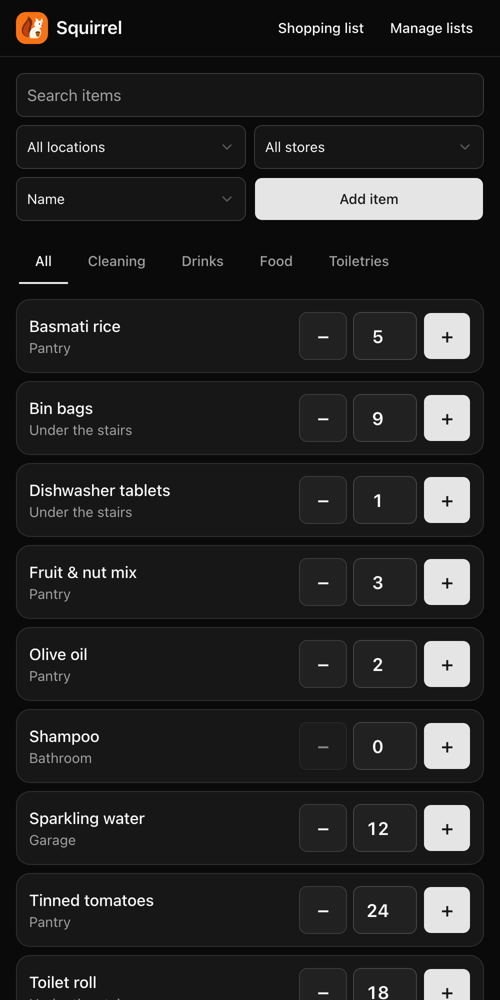

# 🐿️ Squirrel

Squirrel is a small, self-hosted web app that counts the stock in your house.

You buy toothpaste, tinned tomatoes and fruit & nut mix in bulk, and you put it all over the house. Squirrel tells everyone in the household how many of each thing is left. Tap **−1** when you take one out. Tap **+1** when you put one away.

Squirrel does not decide when to buy more. You look at the counts and decide.

<p align="center">
  
</p>

## Features

- A list of items with large **−1** and **+1** buttons, made for one hand on a phone.
- Tap a count to type an exact number.
- Tabs for **All** and for each category, plus search and filters for location and store.
- Every change is recorded. See the last 10 changes of an item and **undo** the latest one.
- Categories, locations and stores are lists that you manage in the app.
- Works on a phone and on a desktop. Add it to your home screen for a full-screen app.
- A shopping list: the items with a count of 0, grouped by store.
- Export your items to a CSV file, and import items from one.
- A read-only JSON API for dashboards and home automation, for example Home Assistant.
- One small container. One SQLite file. No internet needed at runtime.

## Security: read this first

> [!WARNING]
> **Squirrel has no login.** Anyone who can reach it can read and change your stock.
> Run it on a trusted home network only.
>
> To use it away from home, put it behind a reverse proxy or tunnel that signs people in. For example, use [Cloudflare Tunnel](https://developers.cloudflare.com/cloudflare-one/connections/connect-networks/) with [Cloudflare Access](https://developers.cloudflare.com/cloudflare-one/policies/access/). Do not open the port to the internet.

## Quick start

### Docker Compose

Save this as `docker-compose.yml`, then run `docker compose up -d`.

```yaml
services:
  squirrel:
    image: ghcr.io/andrewmooreio/squirrel:latest
    container_name: squirrel
    restart: unless-stopped
    ports:
      - "8080:8080"
    volumes:
      - squirrel-data:/data

volumes:
  squirrel-data:
```

### Docker run

```sh
docker run -d \
  --name squirrel \
  --restart unless-stopped \
  -p 8080:8080 \
  -v squirrel-data:/data \
  ghcr.io/andrewmooreio/squirrel:latest
```

Open <http://localhost:8080>.

### First start

Squirrel starts empty. Before you add an item, open **Manage lists** and create at least one category, one location and one store. Then add your first item.

## Configuration

Set these environment variables on the container. All of them are optional.

| Variable           | Default             | Meaning                     |
| ------------------ | ------------------- | --------------------------- |
| `SQUIRREL_HOST`    | `0.0.0.0`           | Address to listen on        |
| `SQUIRREL_PORT`    | `8080`              | Port to listen on           |
| `SQUIRREL_DB_PATH` | `/data/squirrel.db` | Path of the SQLite database |

If you change `SQUIRREL_PORT`, change the port mapping too. The container runs as a non-root user (UID 65532), so a folder that you mount at `/data` must be writable by that user.

## Image tags

Images are built for `linux/amd64` and `linux/arm64`. They run on a server, a NAS or a Raspberry Pi.

| Tag                 | What it is                                     |
| ------------------- | ---------------------------------------------- |
| `1.2.3`             | One exact release                              |
| `1.2`               | The newest `1.2.x` release                     |
| `1`                 | The newest `1.x.x` release                     |
| `latest`            | The newest release                             |
| `edge`              | The newest commit on `main`, not yet released  |
| `sha-<short>`       | One exact commit on `main`                     |

To avoid surprises, pin to `1` or `1.2`. Read the [changelog](CHANGELOG.md) before you upgrade. Database changes run by themselves when the container starts.

The version shows at the bottom of every page. An `edge` image shows `edge-` and the commit.

## Backups

Squirrel keeps everything in one SQLite file, in WAL mode, in the `/data` volume.

Back up the **whole `/data` volume**, not only `squirrel.db`. In WAL mode, recent changes can be in the `-wal` file next to it.

For the safest backup, stop the container first:

```sh
docker compose stop squirrel
docker run --rm -v squirrel-data:/data -v "$PWD":/backup busybox \
  tar czf /backup/squirrel-backup.tar.gz -C /data .
docker compose start squirrel
```

To restore, stop the container and unpack the archive into the volume.

A CSV export is handy to move items or to edit them in a spreadsheet. It is not a full backup, because it has no history. Back up the `/data` volume for that.

## Health check

`GET /healthz` returns `200 ok` when the database is reachable. The image already uses it for its Docker health check. You can also point your reverse proxy or monitoring at it.

## JSON API

Squirrel has a read-only JSON API. Use it for dashboards and home automation. It cannot change your stock.

> [!WARNING]
> The API has no login, like the rest of Squirrel. Anyone who can reach Squirrel can read it. Read [Security](#security-read-this-first).

| Endpoint                | Returns                      |
| ----------------------- | ---------------------------- |
| `GET /api/items`        | A list of items              |
| `GET /api/items/{id}`   | One item                     |

`GET /api/items` takes these query parameters. All of them are optional.

| Parameter  | Meaning                                                              |
| ---------- | -------------------------------------------------------------------- |
| `q`        | Search in the name                                                   |
| `category` | A category id, or `none` for items without a category                |
| `location` | A location id                                                        |
| `store`    | A store id                                                           |
| `sort`     | `count` (lowest first) or `updated` (newest first). Default: name    |

```sh
curl 'http://localhost:8080/api/items?sort=count'
```

```json
{
  "items": [
    {
      "id": 1,
      "name": "Tinned tomatoes",
      "count": 3,
      "category": "Food",
      "location": "Garage",
      "store": "Costco",
      "notes": "",
      "updated_at": "2026-10-05T09:40:33Z"
    }
  ]
}
```

A list field that is blank is `null`. Times are UTC. An empty list is `[]`.

Errors are JSON, for example `{"error":"Not found."}`. An unknown item gives `404`. An id that is not a number gives `400`.

## Development

You need Go. The Makefile downloads the Tailwind CLI and `golangci-lint` into `./bin`. You do not need Node.js.

```sh
make run        # generate templ code, build the CSS, run on :8080 with ./tmp/squirrel.db
make test       # run all tests
make lint       # run golangci-lint
make generate   # run templ generate (commit the result)
make css        # rebuild the stylesheet
```

The stack is Go (`net/http`), [templ](https://templ.guide), [HTMX](https://htmx.org), [Tailwind CSS](https://tailwindcss.com) with [Basecoat](https://basecoatui.com), and SQLite through [`modernc.org/sqlite`](https://pkg.go.dev/modernc.org/sqlite). All assets are embedded in the binary.

Commits follow [Conventional Commits](https://www.conventionalcommits.org). Releases and version numbers come from them through [release-please](https://github.com/googleapis/release-please).

## Licence

[MIT](LICENSE)
